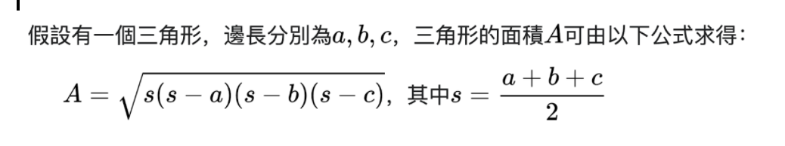

# **220306**
## **Note:**

**Exercise:**

**1. 英制單位英吋與公制單位釐米互換。**

```python
length = float(input('請輸入長度：'))
unit = input('請輸入單位：')
if unit == 'inch':
  print('%.2finch= %.2fcm' % (length,length/2.54))
elif unit=='cm':
  print('%.2finch = %.2fcm' % (length, length*2.54) )
else:
  print ('value error')
```

**2. 百分製成績轉換為等級製成績。**

```python
x = float(input('你的成績為:'))
if 90 <= x <= 100 :
  print('A')
elif 90 > x >= 80:
  print('B')
elif 80 > x >= 70:
  print('c')
elif 70 > x >= 60:
  print('D')
elif 60 > x >= 0:
  print('E')
else:
   print('value error')
```

**3. 輸入三條邊長，如果能構成三角形就計算周長和面積。**



```python
hint:
[s*(s-a)*(s-b)*(s-c)]**0.5
(s*(s-a)*(s-b)*(s-c))**0.5

a = int(input('請輸入a:'))
b = int(input('請輸入b:'))
c= int(input('請輸入c:'))
(a+b+c)>0
if (a+b>c)&(a+c>b)&(b+c>a):
   s = (a+b+c)/2
   m = a+b+c
   A = (s*(s-a)*(s-b)*(s-c))**0.5
   print('周長=%d,面積=%.2f' % (m,A))
else:
   print('不構成三角形')
```
